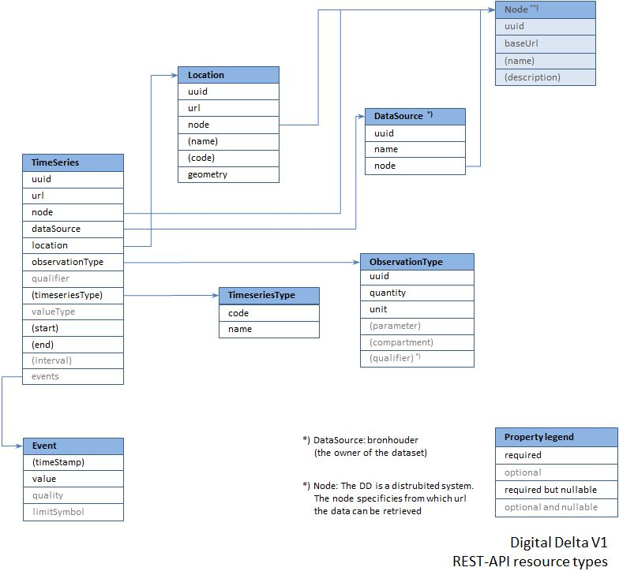

The API specification consists of two parts.
 <ol>
   <li>The Types section describes the data types that are available for the resources. Please refer to figure 1 below for the resource object diagram.
    <i>Note&colon; Currently, the generated HTML documentation does not contain tables that describe the data types. However, their content can be seen in the response tabs of the requests. If you want to have a detailed look at the type definitions, open the RAML file and go to the “# Base types.” section.</i>
   </li>
   <li>The Resources section describes the available end-points.</li>
 </ol>

 
<i>Figure 1</i>

 
The Digital Delta uses uuids (universally unique identifier, version 4) for identification of resource objects. 
 The use of uuids guarantees a unique identifier for an instance over all nodes in the Digital Delta without the need for individual nodes to have a knowledge about data in other nodes. 
 There is a code attribute as well that can be used by suppliers for their internal identifiers. 
 The Digital Delta supports timeseries data, defined as a measurement series with a begin and end time, a fixed location and a parameter.  
 The list of objects is setup to be extendable to other data types, such as raster or vector data.   
 The protocols provides by the services are HTTP and HTTPS. Currently authentication is Anonymous.   
 The Digital Delta only supports JSON as the output format and for POST request bodies.

